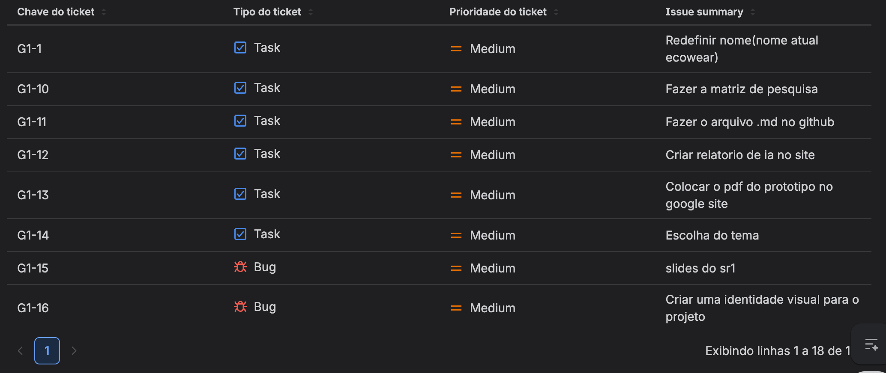
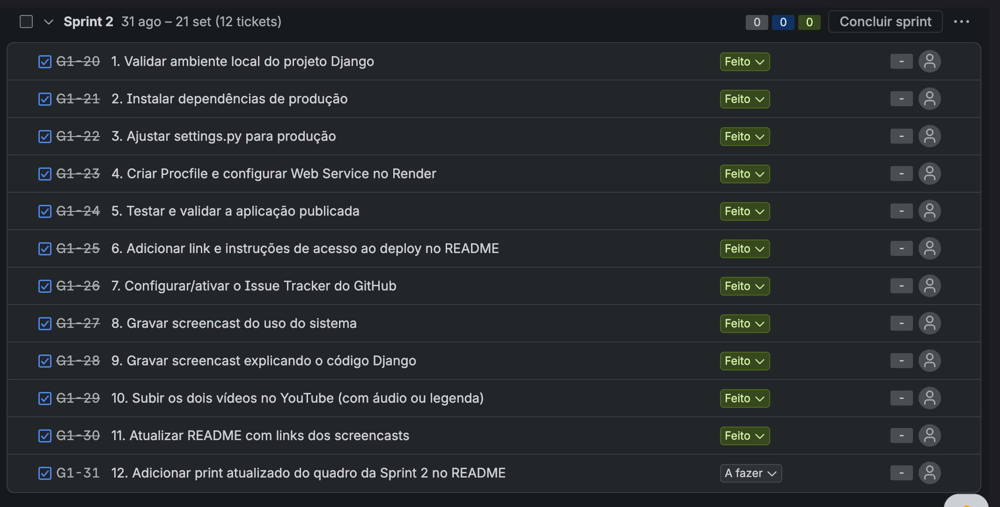
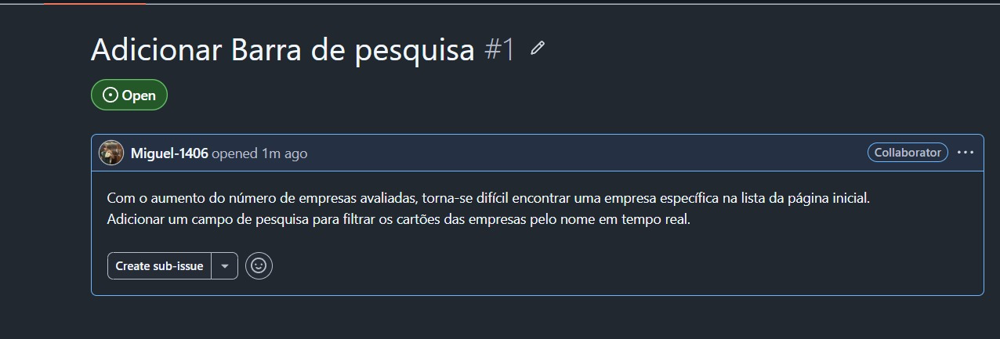

# [Nome do Projeto] — Plataforma de Gestão ESG para PMEs

> Nome ainda não definido.

## 📋 Descrição do Projeto

Plataforma web para pequenas e médias empresas acompanharem seus indicadores, metas e ações de sustentabilidade (ESG — Ambiental, Social e Governança) em um único painel centralizado, inspirada na análise de mercado de ferramentas como Paresi, ESG Business, Minha Pegada, Orkea e EcoVadis.

## 🧭 Páginas do site

| Página | URL | Descrição |
|---|---|---|
| Diagnóstico (Início) | `/` | Formulário e resultados do diagnóstico de maturidade ESG |
| Sobre o projeto | `/sobre/` | O que estamos construindo, para quem, e como chegamos até aqui |
| Quem somos | `/quem-somos/` | Integrantes da equipe |
| Fale conosco | `/contato/` | Formulário de contato (bug, sugestão, dúvida) — respostas ficam salvas no banco e são visíveis no `/admin/` |

## 👥 Equipe

- Rodrigo Barbosa
- Joao Miguel
- Arthur Siqueira
- Rafael Queiroz
- Fernando Sotero
- Joao Victor Moraes
- Paulo Andre
- Marina Pontes
- Ana Beatriz
- Maria Clara
- Daniel

## 📄 Documentação

- [Documento de Análise de Competidores](./relatório_de_análise_de_competidores.md) — benchmark com 5 concorrentes, pontos fortes/fracos e requisitos levantados

## ✅ Requisitos do Produto (não triviais)

1. **Matriz de setores ESG filtrável** — o sistema deve permitir visualizar e filtrar indicadores por categoria (Ambiental, Social, Governança/Econômico) e por "Todos", cruzando dados de diferentes frentes em uma única matriz.
2. **Painel de indicadores com meta e progresso** — o sistema deve calcular e exibir o percentual de atingimento de uma meta (ex: 60%) com barra de progresso, junto de métricas auxiliares (nº total de tarefas, % de tarefas em dia/TPR, status de faturamento ativo).
3. **Comparativo de desempenho por período** — o sistema deve gerar um gráfico de evolução (ex: linha temporal) comparando o desempenho do período atual com o anterior, calculando automaticamente a variação percentual (ex: +14%).
4. **Gestão de status de ações** — o sistema deve classificar e contabilizar ações em pelo menos três estados (em andamento, aguardando início, concluídas), permitindo atualização do status por meio de checkboxes.
5. **Acompanhamento de metas trimestrais de ações sustentáveis** — o sistema deve rastrear o progresso de ações sustentáveis planejadas versus realizadas dentro de um período trimestral (ex: 4/10 ações), exibindo o percentual concluído.

## 📊 Benchmark

Tabela comparativa disponível no [documento de análise de competidores](./relatório_de_análise_de_competidores.md).

## 🖼️ Quadro da Sprint

### Sprint 01



### Sprint 02



## 🐛 Issue Tracker

Bugs e pendências são registrados nas [Issues do repositório no GitHub](https://github.com/R0DR1G9/projetos2_grupo15/issues).



## 🚀 Deploy

- **URL em produção:** https://projetos2-grupo15.onrender.com
- **Como rodar localmente:**
```bash
git clone https://github.com/R0DR1G9/projetos2_grupo15.git
cd projetos2_grupo15
python -m venv venv
source venv/bin/activate  # Windows: venv\Scripts\activate
pip install -r requirements.txt
python manage.py migrate
python manage.py runserver
```

## 🎥 Screencasts

- **Uso do sistema:**
- [link do YouTube](https://youtu.be/2ni9VbnhRu0)

- **Explicação do código:**
- [link do YouTube](https://youtu.be/rq166RePr94)

## 🔗 Acesso ao Repositório

- **Repositório GitHub:** https://github.com/R0DR1G9/projetos2_grupo15
- **Como clonar:**
```bash
  git clone https://github.com/R0DR1G9/projetos2_grupo15.git
```

## 🛠️ Tecnologias (previstas)

- [x] Backend: Django 
- [x] Frontend: HTML/CSS
- [X] Banco de dados: Sqlite
